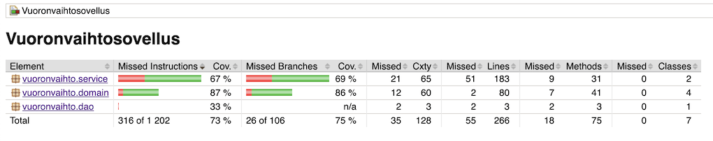

# Testausdokumentti

Ohjelmaa on testattu automatisoiduilla testeillä käyttäen JUnit- ja SpringRunner-testejä. Ohjelmaa on myös testattu manuaalisesti.

## Yksikkö- ja integraatiotestaus

### Sovelluslogiikka

Logiikkaa testataan ServiceTest-luokalla. Tässä testataan logiikan eri komponentteja myös luokkia yhdistämällä, simuloiden sovelluksen toimintaa.

### DAO-luokat

Testaus tehdään SpringRunnerilla käyttämällä muistiin tehtyä tilapäistä tietokantaa.

### Testauskattavuus

Testien ajossa on ollut ongelmia Spring-sovelluskehyksen takia. Testit eivät tunnu löytävän daoService-luokan kaikkia metodeja, enkä keksi tähän enää mitään ratkaisua. Tästä johtuen testikattavuus
jää daoService-luokan osalta alhaiseksi.

## Järjestelmätestaus

Sovelluksen järjestelmätestaus on suoritettu manuaalisesti.

### Asennus ja konfigurointi

Sovellus on haettu ja testattu OS X:llä, Cubblilla sekä X-ikkunoidulla etäyhteydellä melkki.cs.helsinki.fi:llä. Toiminnassa ei havaittu eroja, poislukien X-ikkunnoinnin aiheuttama JavaFX-käyttöliittymän puuttellinen renderöinti.

### Toiminnallisuudet

Kaikki määrittelydokumentin toiminnallisuudet on testattu manuaalisesti.
